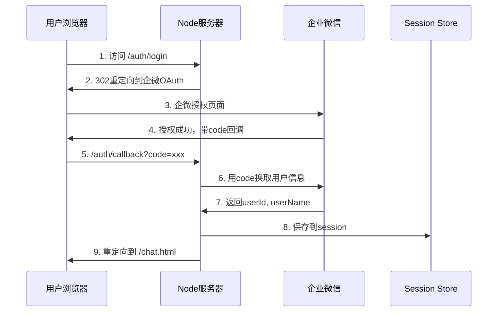
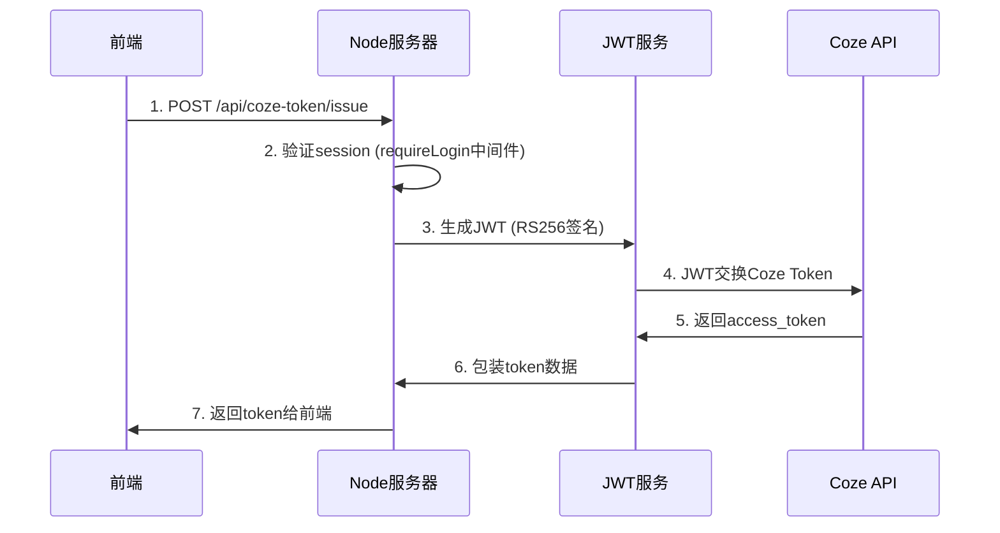
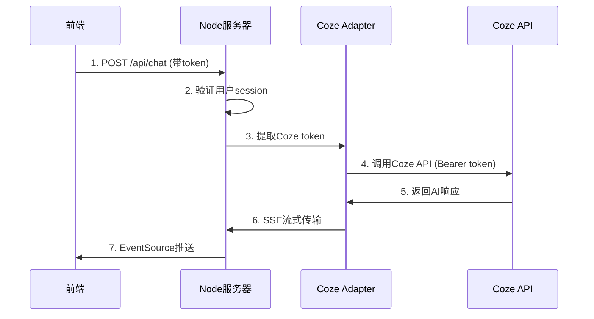
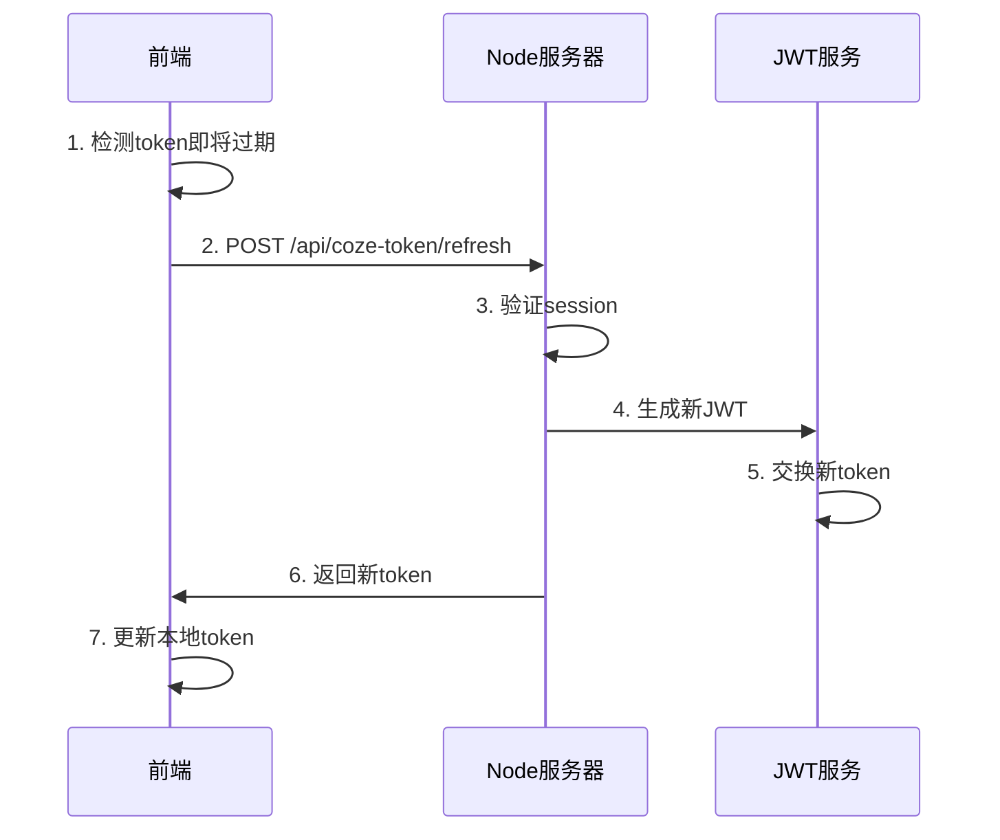

# 企业微信 + JWT 认证流程架构文档

## 整体架构

系统采用**双层认证架构**：
1. **用户身份认证层**：企业微信OAuth认证，确认用户身份
2. **API访问认证层**：JWT Bearer Token认证，访问Coze AI API

## 认证流程图

```
用户 --> 企微OAuth --> Session --> JWT生成 --> Coze Token --> API调用
```

## 详细认证流程

### 1. 用户登录流程 (企业微信OAuth)



**关键代码位置**：
- `/server/routes/auth.js:26-35` - 登录路由
- `/server/routes/auth.js:43-73` - OAuth回调处理
- `/server/utils/user.js` - 用户信息获取

**Session数据结构**：
```javascript
req.session = {
    userId: 'zhangsan',        // 企微用户ID
    userName: '张三',           // 用户姓名
    userInfo: {...},           // 完整用户信息
    loginTime: 1758002384744   // 登录时间戳
}
```

### 2. JWT Token生成流程



**关键代码位置**：
- `/server/routes/api.js:185-209` - Token签发端点
- `/server/middleware/auth.js:13-107` - requireLogin中间件
- `/server/utils/jwtService.js:52-100` - JWT生成
- `/server/utils/jwtService.js:107-182` - Token交换

**JWT Payload结构**：
```javascript
{
    iss: "1174792647356",           // client_id
    sub: "zhangsan",                 // 用户ID
    aud: "api.coze.cn",             // 受众
    iat: 1758002384,                // 签发时间
    exp: 1758005984,                // 过期时间
    jti: "uuid-xxx"                 // JWT ID
}
```

### 3. API调用流程



**关键代码位置**：
- `/server/routes/api.js:119-179` - Chat API端点
- `/server/services/chatService.js` - 聊天服务
- `/server/utils/cozeSDKAdapter.js` - Coze SDK适配器

### 4. Token刷新流程



**关键代码位置**：
- `/server/routes/api.js:212-230` - Token刷新端点
- `/public/js/cozeClient.js` - 前端自动刷新逻辑

## 模块交互关系

### 后端模块

```
app.js (Express主应用)
    ├── /auth/* 路由 (auth.js)
    │   ├── getUserInfoByCode() --> 企微API
    │   └── 创建Session
    │
    ├── requireLogin中间件 (middleware/auth.js)
    │   ├── 检查Session
    │   └── 设置req.userId
    │
    ├── /api/coze-token/* 路由 (api.js)
    │   ├── jwtService.buildOAuthJWT()
    │   ├── jwtService.exchangeForAccessToken()
    │   └── 返回token
    │
    └── /api/chat 路由 (api.js)
        ├── chatService.chat()
        ├── cozeSDKAdapter.chat()
        └── SSE流式响应
```

### 前端模块

```
chat.html
    ├── cozeClient.js
    │   ├── getCozeToken() --> /api/coze-token/issue
    │   ├── setupTokenRefresh()
    │   └── refreshToken() --> /api/coze-token/refresh
    │
    └── chat.js
        ├── 发送消息 --> /api/chat
        └── EventSource接收流式响应
```

## 认证状态转换

```
[未登录] --企微OAuth--> [已登录有Session] --请求JWT--> [有JWT Token] --交换--> [有Coze Token] --API调用--> [获得AI响应]
                              ↑                                                      |
                              |---------------- Token过期，自动刷新 -----------------|
```

## 关键配置

### 环境变量
```bash
# 企业微信配置
CORP_ID=xxx                    # 企业ID
CORP_SECRET=xxx                 # 应用密钥
AGENT_ID=xxx                    # 应用ID

# JWT配置
COZE_OAUTH_CLIENT_ID=xxx       # Coze客户端ID
COZE_OAUTH_AUDIENCE=api.coze.cn
COZE_OAUTH_KID=xxx              # 密钥ID
COZE_OAUTH_PRIVATE_KEY_PATH=./server/private_key.pem

# Coze API配置
COZE_API_KEY=xxx                # API密钥
COZE_BOT_ID=xxx                 # 机器人ID
COZE_WORKSPACE_ID=xxx           # 工作空间ID
```

### Session配置
```javascript
// app.js
session({
    secret: process.env.SESSION_SECRET,
    resave: false,
    saveUninitialized: false,
    cookie: {
        secure: false,      // HTTPS时设为true
        httpOnly: true,
        maxAge: 24*60*60*1000  // 24小时
    }
})
```

## 安全机制

1. **企微OAuth**：确保只有企业内部用户可以登录
2. **Session隔离**：每个用户独立session，互不干扰
3. **JWT签名**：RS256非对称加密，私钥安全存储
4. **Token过期**：自动刷新机制，避免中断
5. **HTTPS传输**：生产环境强制HTTPS
6. **私钥保护**：.gitignore排除，文件权限600

## 错误处理

### 常见错误及解决

1. **401 Unauthorized**
   - 原因：Session过期或无效
   - 解决：重新登录获取session

2. **TOKEN_ISSUE_FAILED**
   - 原因：JWT生成或交换失败
   - 解决：检查私钥和Coze配置

3. **400 Bad Request (HTTPS)**
   - 原因：HTTP请求发送到HTTPS端口
   - 解决：使用原生https模块

## 开发调试

### 跳过认证模式
```bash
SKIP_AUTH=true npm run dev  # 跳过企微认证
SKIP_OAUTH=true npm run dev # 使用测试用户
```

### 测试命令
```bash
# 测试JWT生成
curl -X POST http://localhost:8892/api/coze-token/issue \
  -H "Cookie: connect.sid=xxx" \
  -d '{"userId": "test"}'

# 测试Token刷新
curl -X POST http://localhost:8892/api/coze-token/refresh \
  -H "Cookie: connect.sid=xxx"
```

## 总结

整个认证流程实现了：
1. **用户认证**：通过企微OAuth确认身份
2. **会话管理**：Express-session维护登录状态
3. **API认证**：JWT Bearer Token访问Coze
4. **自动刷新**：前端主动刷新，保持会话
5. **安全隔离**：多用户独立token和会话